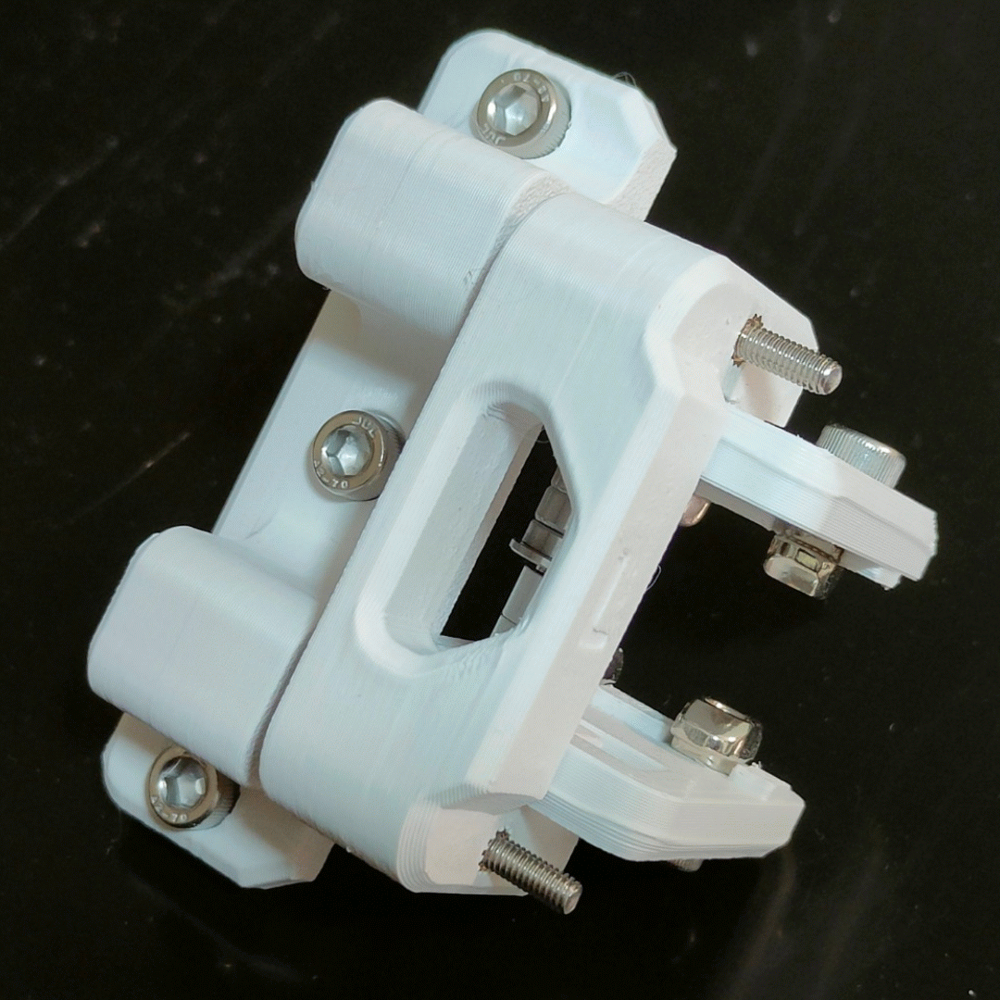
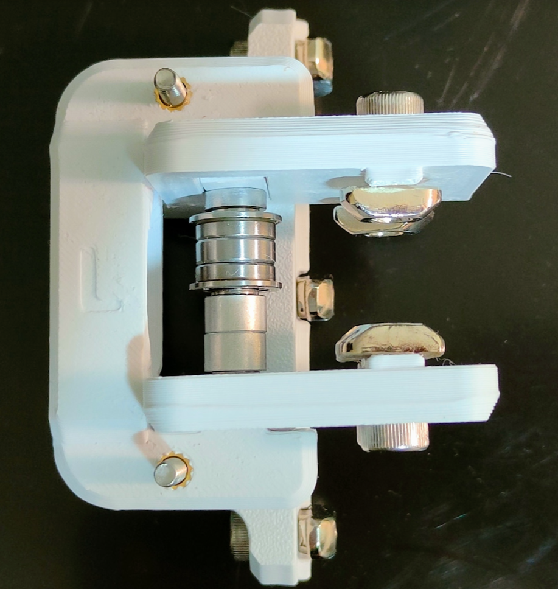
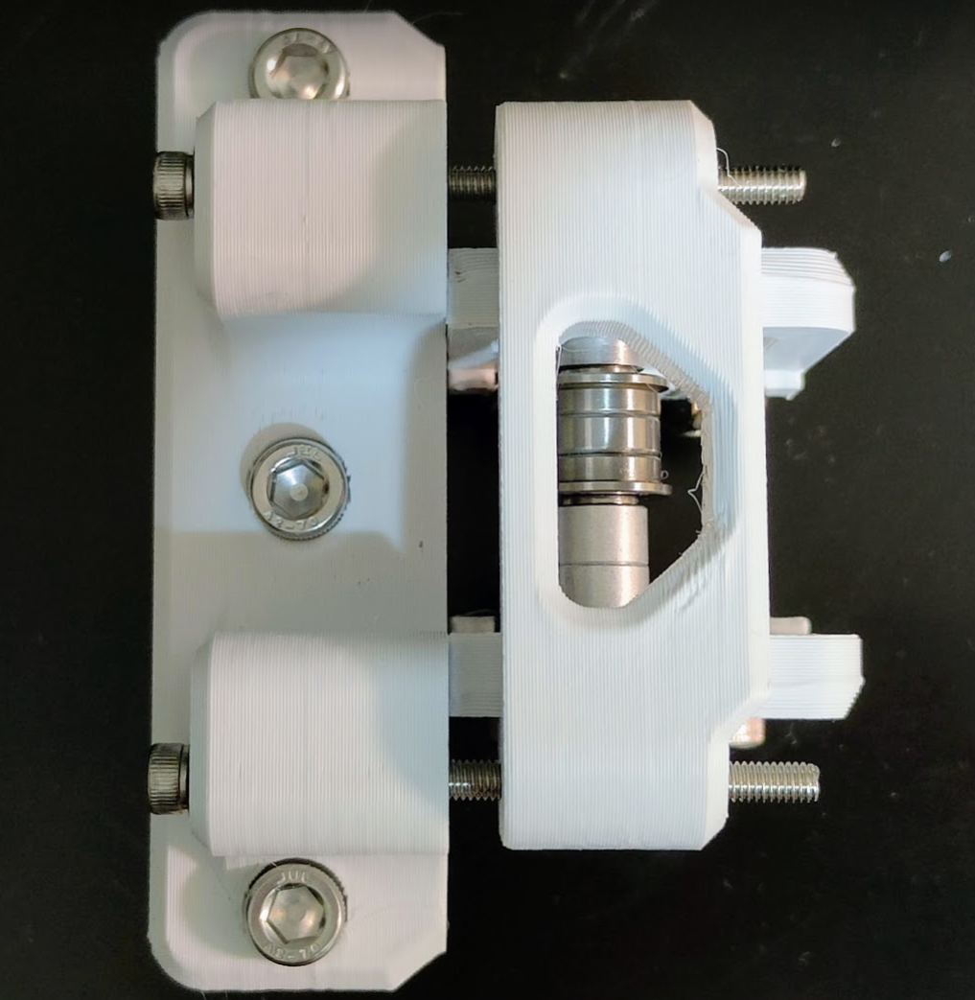
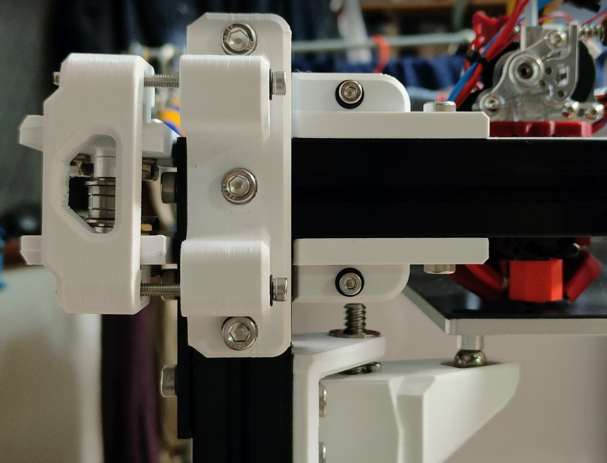
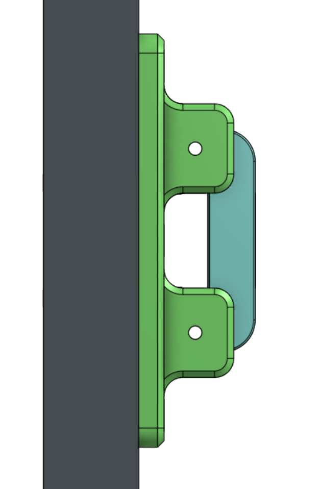
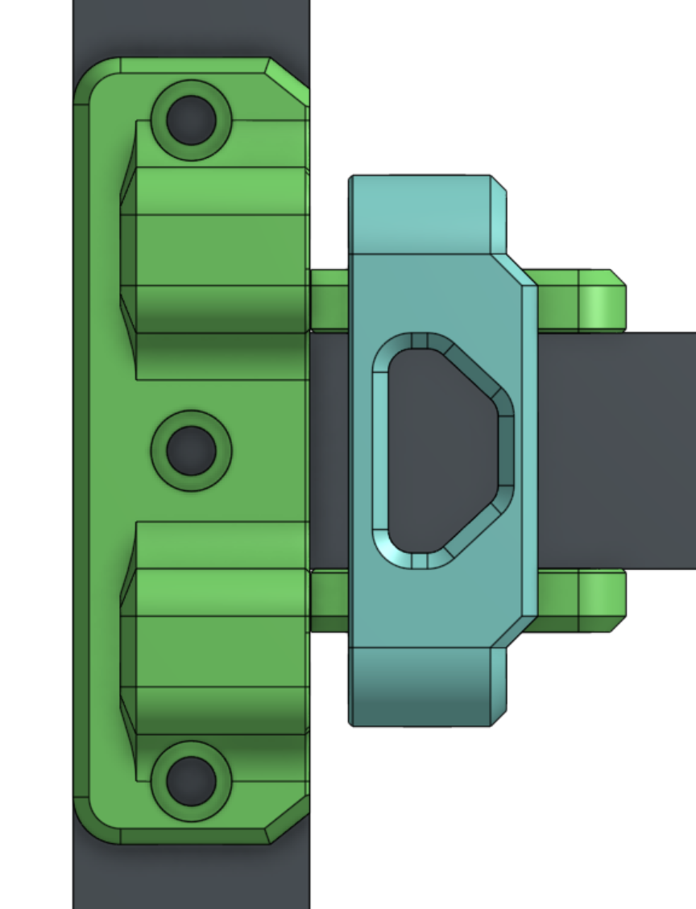
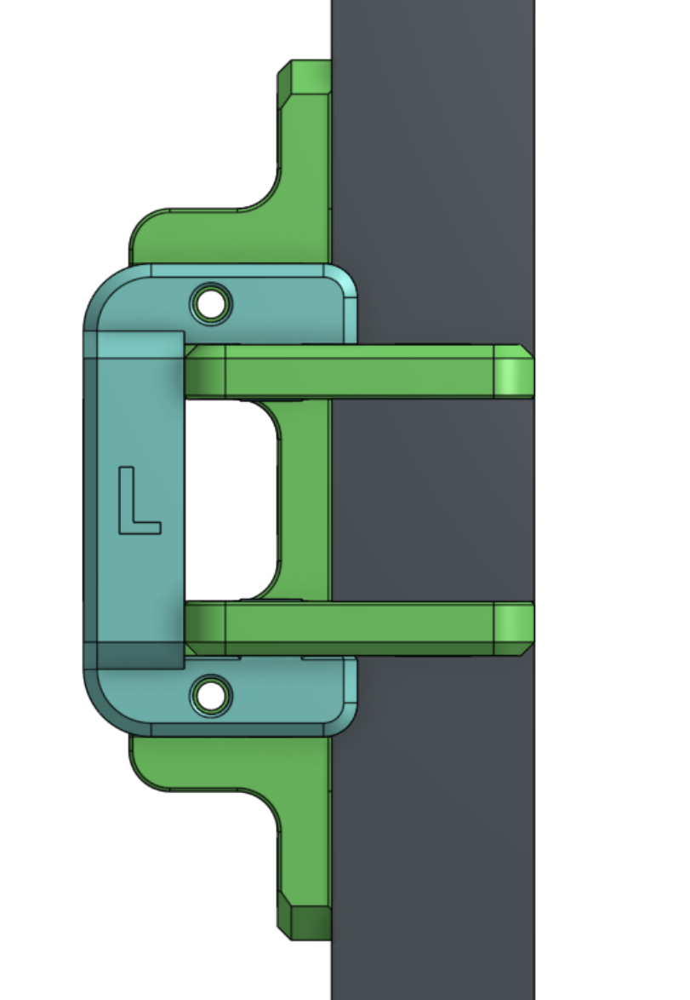

Many thanks to the RATRIG team for making excellent printers.

# RAT RIG XY IDLERS TENSIONERS

RAT RIG XY IDLERS TENSIONERS TENSIONABLE
For Both ENCLOSURE and NON-ENCLOSURE Builds.

- 2023-02-17 - NON-ENCLOSURE supported

- 2023-04-06 - ENCLOSURE supported

# FEATURES

- Both ENCLOSURE and NON-ENCLOSURE SUPPORTED!
- XY idlers thar are Tensioners and Tensonable ~9mm of belt adjustment travel.
- Same size formfactor as stock idlers.

- Designed for use with the VZBot style Hotend Carriages https://github.com/VzBoT3D/Vz-Printhead-Printed

# BOM ENCLOSURE  - SAME PARTS AS THE ENCLOSURE IDLERS

legacy image

- Changes have been made to the idlers so they match the stock build setup/alignments refer to offical manual for spacers/install etc. will add photo soon.
https://ratrig.dozuki.com/Guide/04.+CoreXY+Idler+Assemblies/161?lang=en
- EXISTING hardware set from idlers 6MM SPACERS 3MM SPACERS USE GUIDE ABOVE 
- X2 M5 50 mm minimum OR M5 65-70MM PINS
- x4 M4 60mm TENSION PULL BOLTS
- x4 M4 HeatSetNuts
- x2 M5 HeatSetNuts
- x4 M4 Washers
- X12 M6 8MM BOLTS
- X12 M6 TEE NUTS 

# ENSLOSURE SUPPORTED

CAD Photos

# NON-ENCLOSURE

# NON-ENCLOSURE SPECIAL REQUIREMENTS

- 1 drill hole in front corner plates to be able to access the bottom tension bolt

# YOUTUBE

# ISSUES?

- PLEASE SEND ME FEEDBACK
- Might have collision issues on enclosure lead screw support baracket mount. It will be close - pretty sure it fits with 3mm gap

# FEEDBACK

 - if you install this please send me a photo on discord!
 - Discord julianjc84#7938
 
 # CAD - onshape
 
https://cad.onshape.com/documents/cb96e96d451451da303e27a6/w/4e5024d18ec9d294061dfea9/e/b381e72c0cc41d9cad0768ad