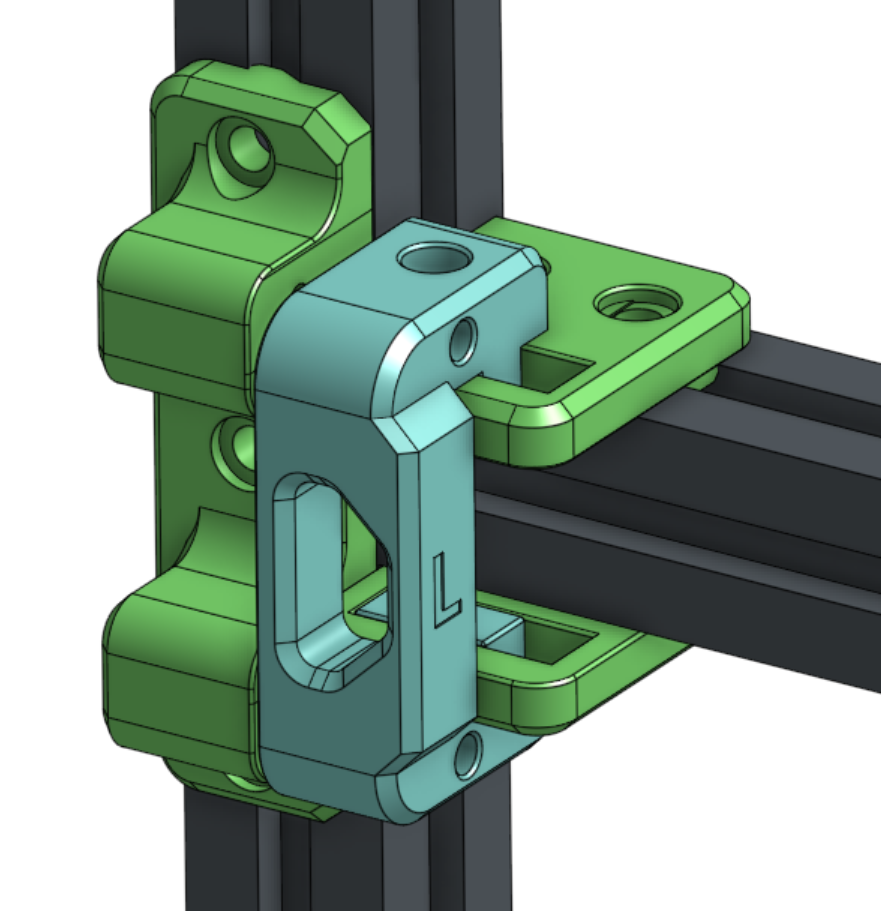
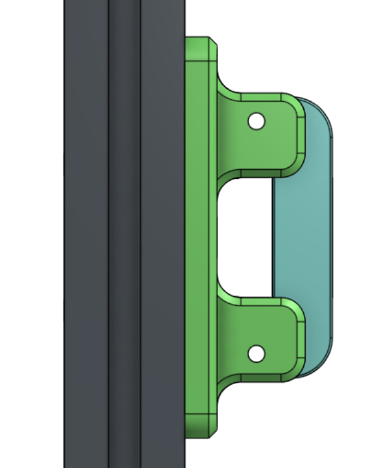
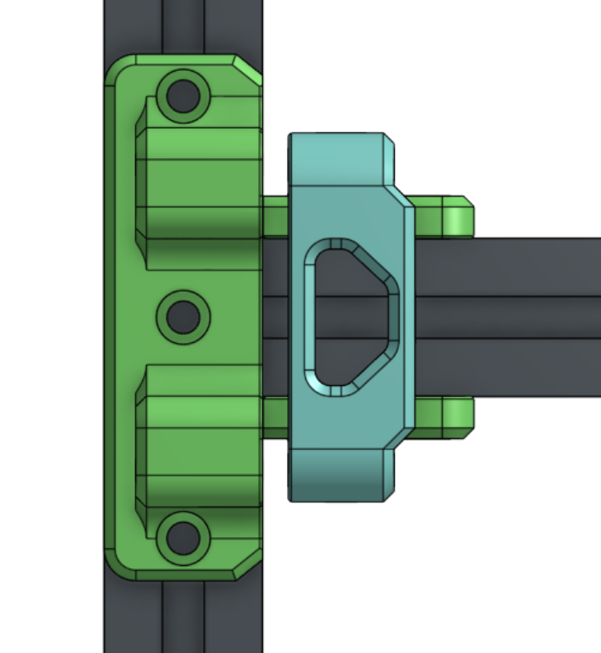
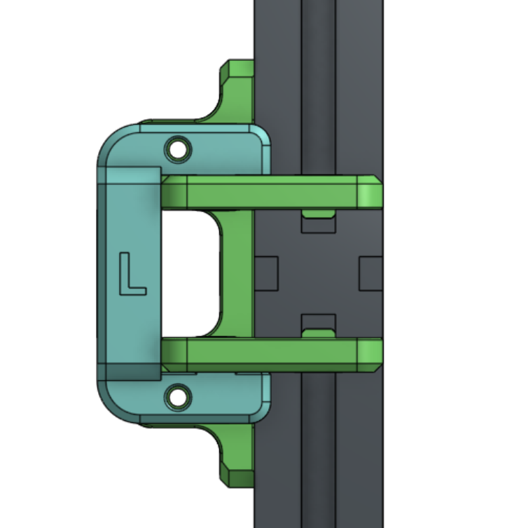

Many thanks to the RATRIG team for making excellent printers.

# RAT RIG XY IDLERS TENSIONERS

RAT RIG XY IDLERS TENSIONERS TENSIONABLE

- 2023-02-17 - REVISION V4 BUILD

# FEATURES

- ENCLOSURE 2.0 SUPPORTED!
- XY idlers
- Tensioners and Tensonable ~10mm of belt adjustment travel HEAPS!
- Same/similar size formfactor as stock idlers

- Designed for use with the VZ Hotend Carriage https://github.com/VzBoT3D/Vz-Printhead-Printed

# BOM ENCLOSUR  - SAME PARTS AS THE ENCLOSURE IDLERS

legacy image

- Changes have been made to the idlers so they match the stock build setup/alignments refer to offical manual for spacers/install etc. will add photo soon.
https://ratrig.dozuki.com/Guide/04.+CoreXY+Idler+Assemblies/161?lang=en
- EXISTING hardware set from idlers 6MM SPACERS 3MM SPACERS USE GUIDE ABOVE 
- X2 M5 50 mm minimum OR M5 65-70MM PINS
- x4 M4 60mm TENSION PULL BOLTS
- x4 M4 HeatSetNuts
- x2 M5 HeatSetNuts
- x4 M4 Washers
- X12 M6 8MM BOLTS
- X12 M6 TEE NUTS 

# ENSLOSURE SUPPORTED

# NON-ENCLOSURE

# NON-ENCLOSURE SPECIAL REQUIREMENTS

- 1 drill hole in front corner plates to be able to access the bottom tension bolt

# YOUTUBE

- COMING SOON

# ISSUES?

- PLEASE SEND ME FEEDBACK
- might have collision issues on enclosue with the leadscrew. need beta tester

# FEEDBACK

 - if you install this please send me a photo on discord!
 - Discord julianjc84#7938
 - ratrigidlers@jc84.com
 
 # CAD
 
https://cad.onshape.com/documents/cb96e96d451451da303e27a6/w/0c1d47e33183047f94674171/e/046a3d88bbcad2d9f30d4c1d?renderMode=0&uiState=64130eeb3fb17b4c3dee6c1c